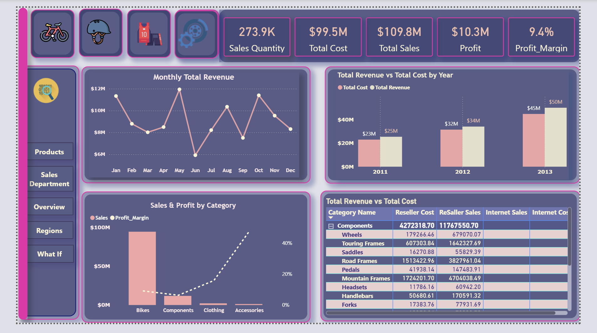
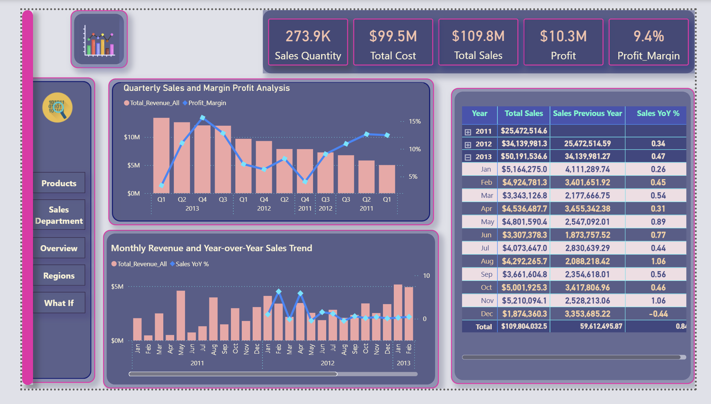
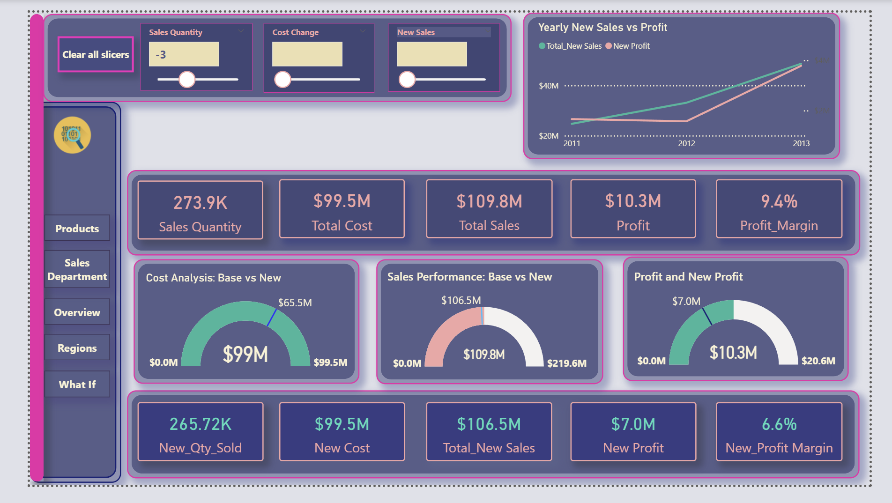

## 📊 Power BI Sales Analysis Dashboard – AdventureWorks Dataset  

This Power BI report visualizes key performance insights derived from the **AdventureWorks** dataset.  
The dashboards focus on **sales quantity, cost, profit, and performance trends** across years, categories, and regions.  

---
### 🔹 Dashboard 1 – Product Insights.

-Monthly Total Revenue  
-Sales & Profit by Category
-Total Revenue vs Total Cost by Year
-Total Revenue vs Total Cost

---
### 🔹 Dashboard 2 –Analyzes regional sales performance.

-Sales vs Profit by Country & Category 
-Number of Customers by Country
-Sales Revenue by Country
-Sales by Category

---
### 🔹 Dashboard 3 – Revenue and Year-over-Year (YoY) Trends  
Analyzes long-term growth patterns and profitability:  

- Quarterly Sales and Profit Margin Analysis  
- Monthly Revenue and YoY Sales Trend visualization  
- Summary table displaying yearly and monthly comparisons  

### 🔹 Dashboard 4 – Sales Department Overview  
Provides insights into individual and regional performance:  

- Sales vs. Target and Variance % by Quarter  
- Top Resellers by Total Revenue  
- Sales contribution by Category and Country  

---

### 🔹 Dashboard 5 – What-If Analysis  
Explores dynamic scenarios for **Sales Quantity**, **Cost Change**, and **New Sales** using adjustable parameters.  

- Visual comparison of base vs. new cost, sales, and profit  
- KPI cards highlight total cost, total sales, and profit margin  
- “What-If” simulation demonstrates how strategic changes affect performance metrics  

Each dashboard is designed with a **consistent color theme**, intuitive layout, and **interactive slicers** to enhance analytical storytelling and decision-making.
